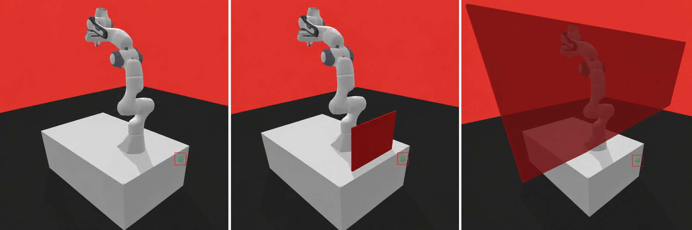
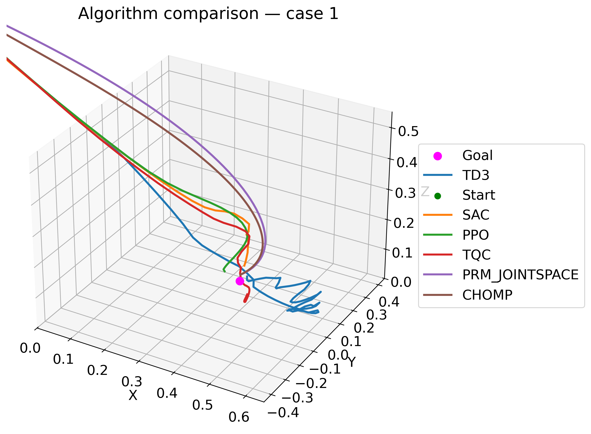
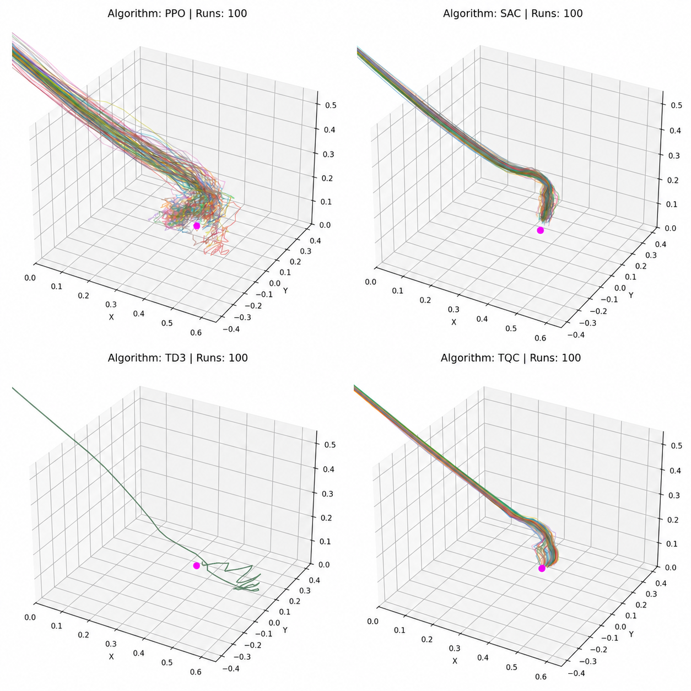
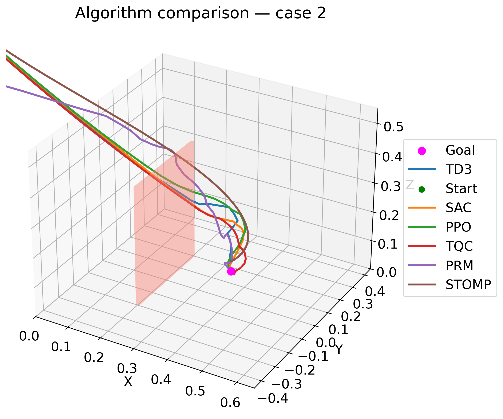
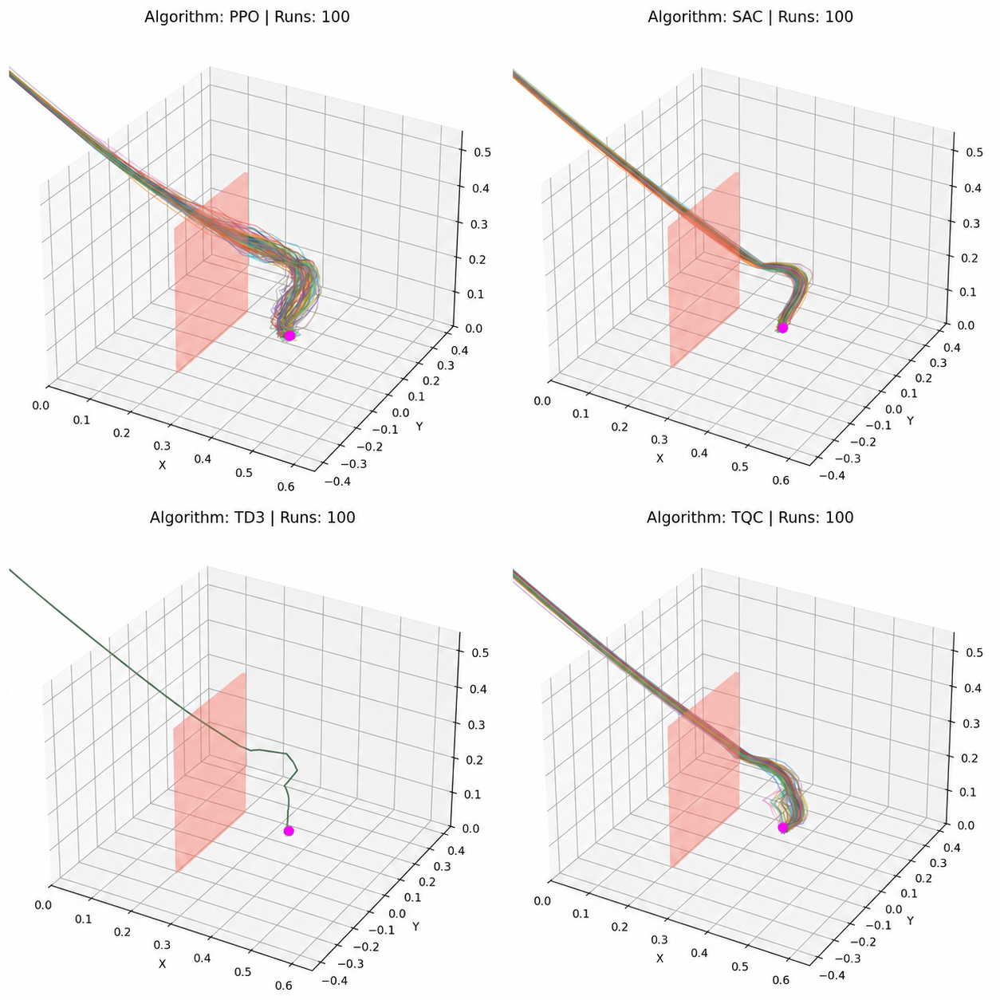
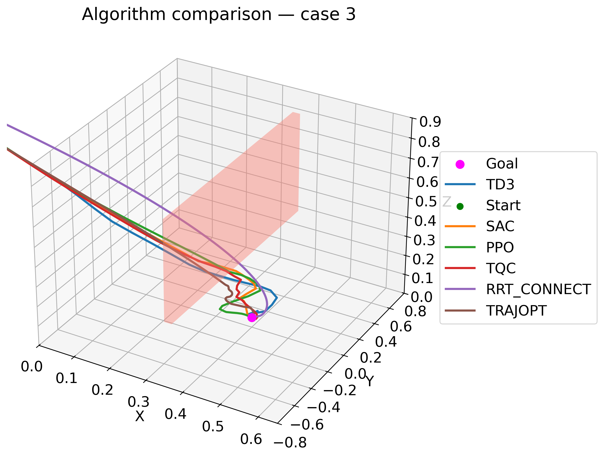
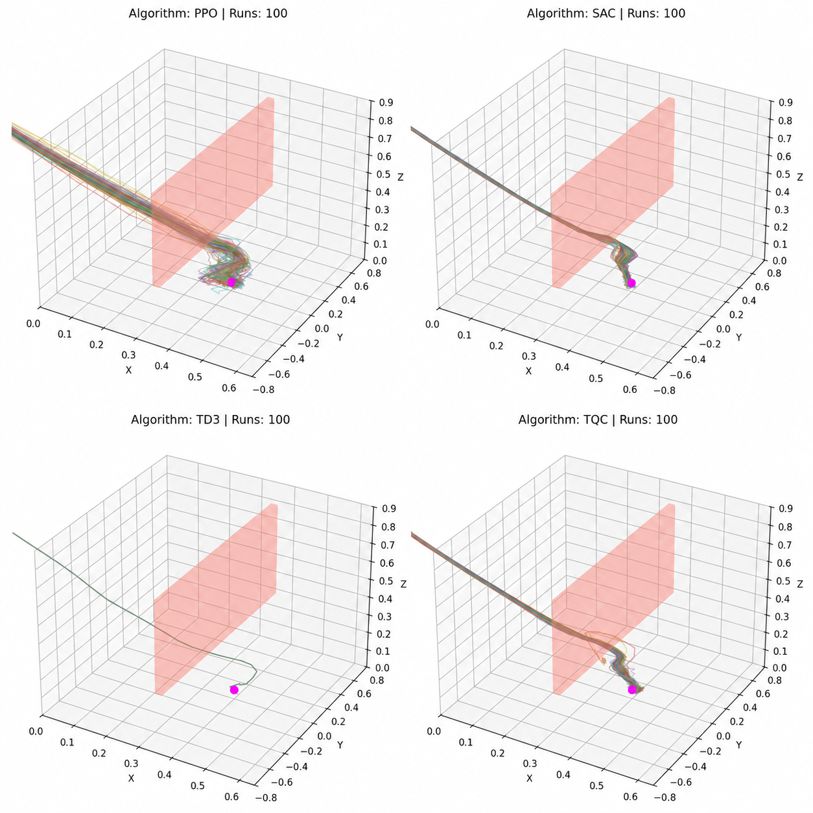
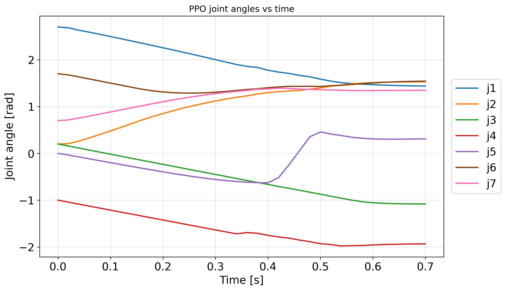
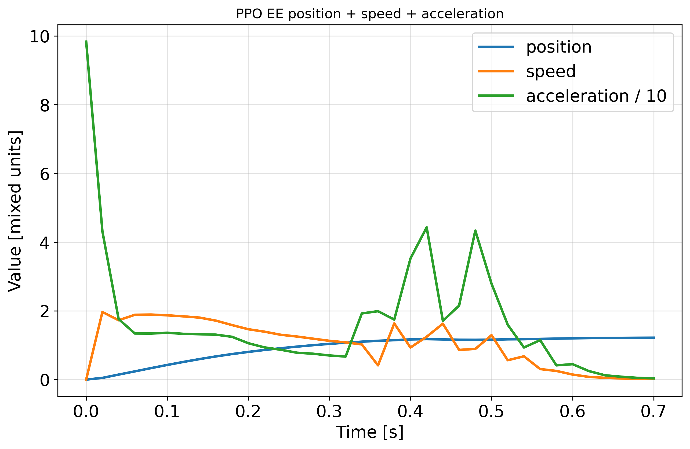

# Motion Planning and Reinforcement Learning for Franka Panda

This folder contains the practical part of a bachelor thesis focused on motion planning and reinforcement learning for the Franka Emika Panda robot in simulation.

The code compares classical planners and RL-based controllers in three benchmark environments with increasing spatial difficulty:

- `case0` - free space
- `case1` - small wall obstacle
- `case2` - high hanging wall with a lower passage

The implementation is based on `panda-gym`, `gymnasium`, `PyBullet`, and `stable-baselines3`.



## What is in this repository

The experiments are organized around three tasks:

1. generate trajectories with classical planning methods,
2. train RL policies for the same tasks,
3. compare trajectory quality, execution time, robustness, and stability.

The final comparison includes both:

- single-run trajectory overlays for all algorithms in one environment,
- repeated-run overlays for one trained RL policy to inspect repeatability.

## Visual overview

### Experiment 1 - Free space

This is the simplest environment and is mainly useful for revealing how different methods behave when obstacle avoidance is not the dominant factor.



The repeated-run plot below shows how one learned RL policy behaves across many executions in the same environment.



### Experiment 2 - Small wall

The second environment introduces a compact obstacle, which forces the robot to modify the shape of the trajectory while still leaving multiple reasonable solutions.



This repeated-run visualization is useful for checking whether a learned policy consistently chooses a similar avoidance pattern.



### Experiment 3 - Hanging wall with lower passage

The third environment is the most constrained one. It requires a more careful spatial maneuver and exposes the difference between fast goal-reaching behavior and mechanically smoother motion.



The repeated-run plot below shows how stable the learned behavior remains when the same trained policy is executed multiple times.



### Example trajectory logs

The comparison scripts also generate detailed time-series plots. A typical pair of outputs is shown below:

- joint angles over time,
- end-effector motion, speed, and acceleration over time.

These plots are used in the thesis to analyze smoothness, corrections near the goal, and dynamic behavior of a selected planner or policy.




## Repository structure

### Main experiment folders

- `case0/`
  - `case0_chomp.py` - CHOMP-style planner
  - `case0_prm.py` - PRM planner
  - `case0_rl_train.py` - RL training for PPO, SAC, TD3, TQC
  - `case0_rl_check.py` - trained-policy evaluation and logging
  - `case0_compare_csv.py`, `compare.py` - trajectory comparison and visualization

- `case1/`
  - `case1_stomp.py` - STOMP-style planner
  - `case1_prm.py` - PRM planner
  - `case1_rl_train.py` - RL training
  - `case1_rl_check.py` - trained-policy evaluation and logging
  - `case1_compare_csv.py` - trajectory comparison and visualization

- `case2/`
  - `case2_trajopt.py` - TrajOpt-style planner
  - `case2_rrtconnect.py` - RRT-Connect planner
  - `case2_rl_train.py` - RL training
  - `case2_rl_check.py` - trained-policy evaluation and logging
  - `case2_compare.py` - trajectory comparison and visualization

### Additional folders

- `robust/`
  - `rl_robustness.py` - repeated-run and cross-case robustness evaluation
  - `rl_stability.py` - stability-oriented repeated execution analysis

- `outputs/`, `analysis_output/`, `rrt_connect_output/`
  - generated CSV logs, figures, trained models, and comparison outputs

- `img/`
  - curated images for repository presentation

- `other/`
  - older prototypes, helper scripts, and archived external experiments

## Installation

Use Python `3.10` or `3.11` in a clean virtual environment.

```bash
python -m venv .venv
source .venv/bin/activate
pip install -r requirements.txt
```

On Windows PowerShell:

```powershell
python -m venv .venv
.venv\Scripts\Activate.ps1
pip install -r requirements.txt
```

## Dependencies

The main scripts in this folder rely on:

- `numpy`
- `pandas`
- `matplotlib`
- `scipy`
- `networkx`
- `scikit-learn`
- `gymnasium`
- `pybullet`
- `panda-gym`
- `stable-baselines3`
- `sb3-contrib`

## Typical workflow

### 1. Train an RL policy

Examples:

```bash
python case0/case0_rl_train.py --algo sac --output-dir outputs/case0_sac
python case1/case1_rl_train.py --algo ppo --output-dir outputs/case1_ppo
python case2/case2_rl_train.py --algo td3 --save-dir outputs/case2_td3
```

Supported RL algorithms:

- `ppo`
- `sac`
- `td3`
- `tqc`

### 2. Evaluate a trained policy

Examples:

```bash
python case0/case0_rl_check.py --algo sac --model-path outputs/case0_sac/case_0_sac_best_policy.zip
python case1/case1_rl_check.py --algo ppo --model-path outputs/case1_ppo/case_1_ppo_best_policy.zip
python case2/case2_rl_check.py --algo td3 --model-path outputs/case2_td3/case_2_td3_best_policy.zip
```

These scripts typically generate:

- end-effector CSV logs,
- joint-space CSV logs,
- timing information,
- trajectory plots.

### 3. Run classical planners

Examples:

```bash
python case0/case0_chomp.py
python case0/case0_prm.py
python case1/case1_stomp.py
python case1/case1_prm.py
python case2/case2_trajopt.py
python case2/case2_rrtconnect.py
```

Many of these scripts also support visual simulation rendering through a `--render` flag or a similar command-line option.

### 4. Compare trajectories and metrics

Examples:

```bash
python case0/case0_compare_csv.py
python case1/case1_compare_csv.py
python case2/case2_compare.py
```

These scripts are used to:

- overlay trajectories in 3D,
- plot joint angles, velocities, and accelerations,
- plot end-effector motion, speed, and acceleration,
- compare algorithms within the same case.

### 5. Evaluate RL robustness and stability

Examples:

```bash
python robust/rl_robustness.py
python robust/rl_stability.py
```

These scripts extend the single-run comparisons with repeated executions and cross-case analysis.

## Recommended starting point

If you want to reproduce the main workflow with the cleanest path, start with:

1. `case0/case0_rl_train.py`
2. `case0/case0_rl_check.py`
3. `case0/case0_compare_csv.py`
4. repeat the same pattern for `case1` and `case2`

After that, move to `robust/rl_robustness.py` and `robust/rl_stability.py` for extended RL evaluation.

## Notes

- The repository contains both final thesis scripts and some older experimental variants kept for reference.
- The most relevant files for reproducing the thesis results are in `case0/`, `case1/`, `case2/`, and `robust/`.
- Output filenames usually follow the pattern `case_<id>_<algo>_<episode_tag>_<kind>.csv`.
